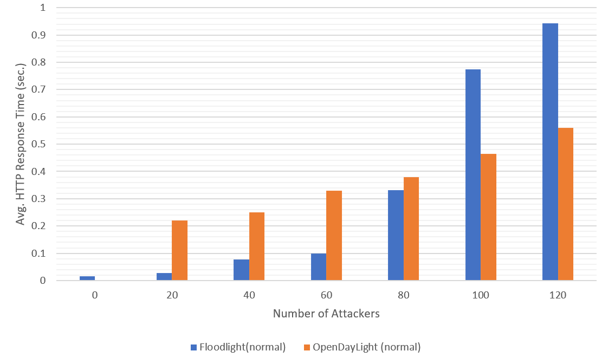

# SDN Final Project

This project implements a modified version of the SLICOTS algorithm on the Floodlight SDN controller that allows the user to configure different values for the `hard_timeout` parameter.

The Mininet script included in this project implements Scenario S1 as described in the SLICOTS paper.

The packet capture for different numbers of attackers over a 180 second period can be found in the `packet_captures` directory.

As of now, only packets captured from an unmodified Floodlight build have been generated.

This projected includes the `ModifiedSLICOTS.java` and `Connection.java` for ease of reading to see what they do. The entire modified Floodlight controller, with these files correctly integrated into the controller, can be found [here](https://github.com/ianw2560/Floodlight-ModifiedSLICOTS). 
Additionally, you see the exact files that were changed [here](https://github.com/ianw2560/Floodlight-ModifiedSLICOTS/commit/56e91063f3d126504dcd88c539870586fc2ec3d7).

## Usage

Start by cloning our modified Floodlight controller with our modified SLICOTS module installed

```
git clone git@github.com:ianw2560/Floodlight-ModifiedSLICOTS.git floodlight
cd floodlight
```

from within the `floodlight` directory, start floodlight
```
java -jar target/floodlight.jar
```

This will start the controller. Now in the Mininet VM, run the Python script. Note: make sure that you change the `controller_ip` variable to use the correct IP address that the floodlight controller is running on.

```
sudo python3 slicots_network_run_test.py
```

The resulting packet capture files (`.pcap`) will be outputted to the directory of the script.

## Results



This is a comparison of the HTTP response time compared to the number of attackers.

## References

```
R. Mohammadi, R. Javidan and M. Conti, "SLICOTS: An SDN-Based Lightweight Countermeasure for TCP SYN Flooding Attacks," in IEEE Transactions on Network and Service Management, vol. 14, no. 2, pp. 487-497, June 2017, doi: 10.1109/TNSM.2017.2701549.
```
